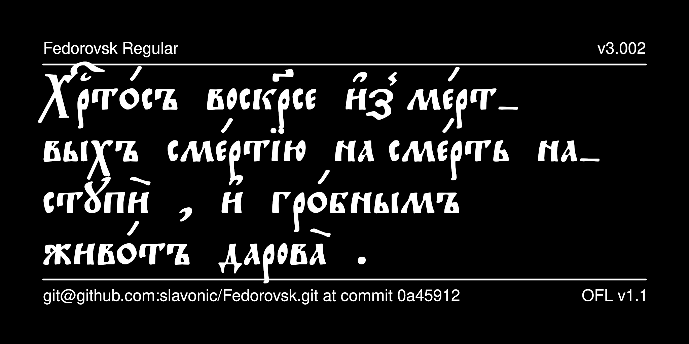

# Fedorovsk Typeface

Fedorovsk is a font designed to mimic the typeface used by Ivan Fedorov, who produced some of the first printed books in Moscow in 1564. It is intended primarily for reproducing publications from the Moscow Print Yard from the late 16th to mid-17th century, either in an academic setting, or as modern Old Rite liturgical texts.



## History

Fedorovsk was designed by Nikita Simmons in 2007 for a legacy codepage.
It was reencoded for Unicode by Aleksandr Andreev as part of the
[Slavonic Computing Initiative](https://sci.ponomar.net/fonts.html)
and edited, released under SIL OFL v. 1.1 and distributed as Fedorovsk Unicode.
Further edited by Aleksandr Andreev and Nikita Simmons.

## License

This Font Software is licensed under the SIL Open Font License,
Version 1.1. This license is available with a FAQ at
[https://openfontlicense.org/](https://openfontlicense.org/).

## Building the Fonts

The font is built using fontmake and gftools post processing script. Tools are all python based, so it must be previously installed.

To install all the Python tools into a virtualenv, do the following:

From terminal:

```

cd your/local/project/directory

#once in the project folder create a virtual environment. 
This step has to be done just once, the first time:

python3 -m venv venv

#activate the virtual environment

source venv/bin/activate

#install the required dependencies

pip install -r requirements.txt

```

Then run the this command:

```
cd sources
gftools builder config.yaml
```

The fonts are supposed to build automatically in the repository 
using GitHub Actions, but this does not work correctly 
for some reason.

## Features

* The font provides a number of ligatures, which are made by inserting the Zero Width Joiner (U+200D) between two characters.

* Stylistic Set 1 (“Right-side accents”) positions the accents over the Yat and the Uk on the right side.

* Stylistic Set 2 (“Left-side accents”) positions the accents over the Yat
and the Uk on the left side. These stylistic sets are useful when a text uses one of these positionings throughout.

* Stylistic Set 10 (“Equal Baseline Variants”) sets the capital letters on the same baseline as the lowercase letters (useful for working
with the font in an academic context where the traditionally lowered baseline of uppercase letters can cause vertical spacing issues when working with text that is both in Latin and Cyrillic scripts). 

* Stylistic Alternatives (*salt*) are provided for the following characters:
- alternative form of U+0404 Capital Ukrainian Ye
- alternative form of U+0426 Capital Tse
- lower truncated forms of U+0440 re, U+0444 ef, U+0445 khe, U+0446 tse, U+0449 shche, U+0463 yat, U+0471 psi, U+A641 zelo
- alternative forms of U+047E Omega and U+047C Ot
- various accented forms of U+047E yat and U+A64B Uk

See your software's documentation about how to access these glyphs.

## More Church Slavonic Fonts

See the [main repository](https://github.com/typiconman/fonts-cu/issues) and the [website](https://sci.ponomar.net/fonts.html).